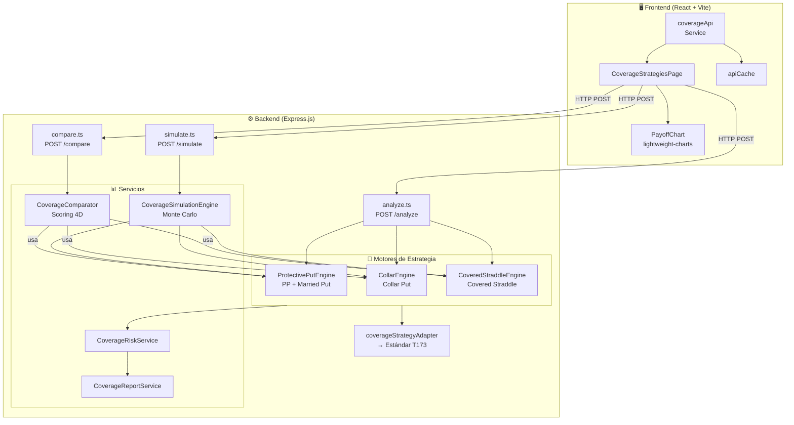
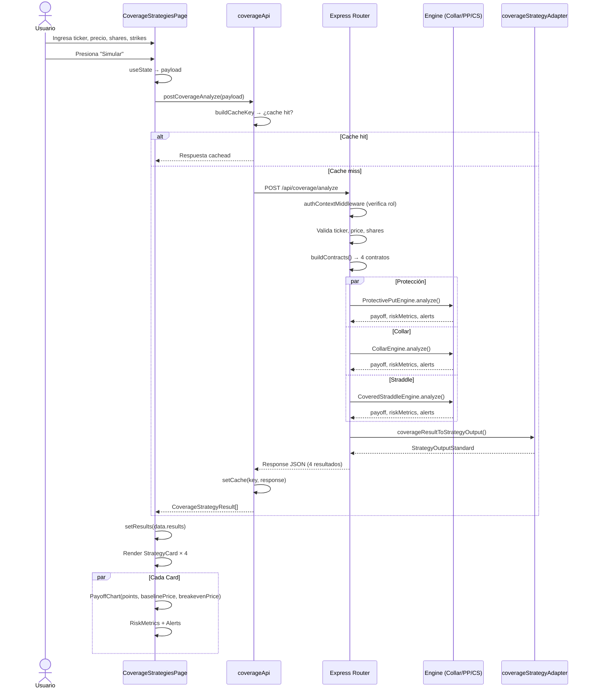
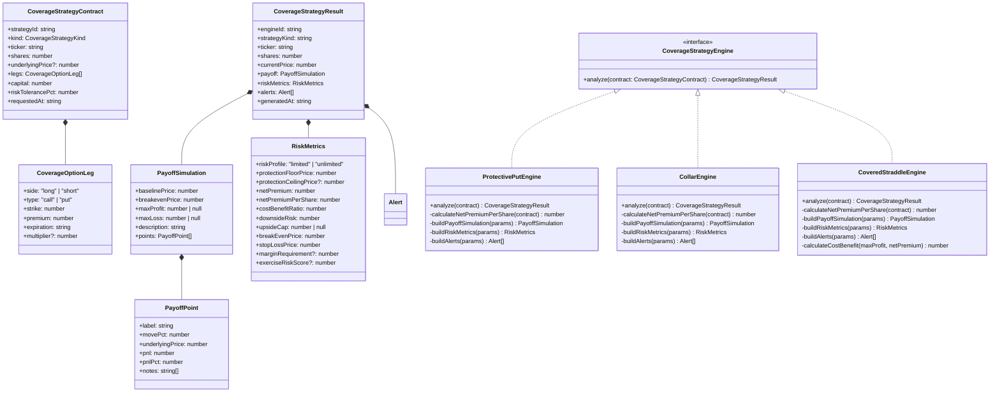
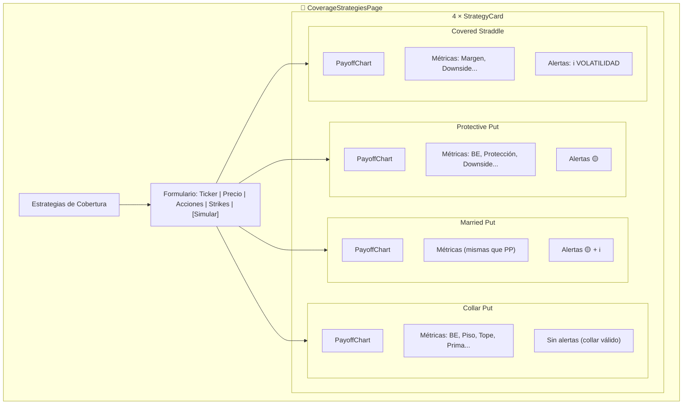
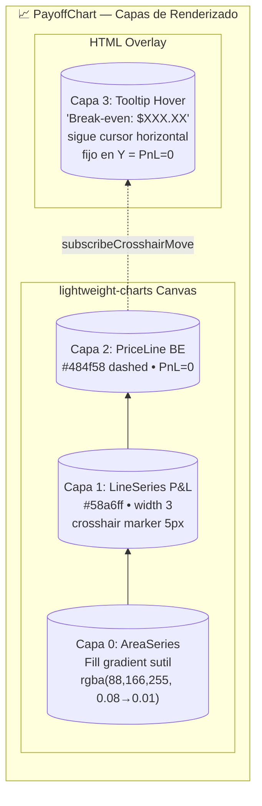
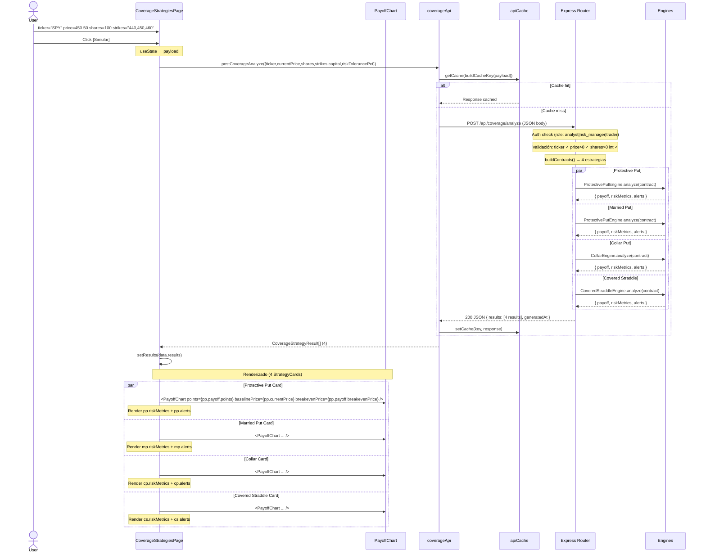

# Módulo de Cobertura — Documentación Completa

**TEAM-05 "TurboPapus"** | **Specs**: 006 + 007 | **Última actualización**: Mayo 2026

---

## Índice

1. [Visión General](#1-visión-general)
2. [Arquitectura del Sistema](#2-arquitectura-del-sistema)
3. [Backend — Motores de Estrategia](#3-backend--motores-de-estrategia)
4. [Backend — Servicios Auxiliares](#4-backend--servicios-auxiliares)
5. [Backend — Rutas REST](#5-backend--rutas-rest)
6. [Frontend — CoverageStrategiesPage](#6-frontend--coveragestrategiespage)
7. [Frontend — PayoffChart](#7-frontend--payoffchart)
8. [Frontend — coverageApi (servicio HTTP)](#8-frontend--coverageapi-servicio-http)
9. [Flujo Completo de Datos](#9-flujo-completo-de-datos)
10. [Contratos JSON](#10-contratos-json)
11. [Bugs Corregidos](#11-bugs-corregidos)
12. [Mejoras Visuales](#12-mejoras-visuales)
13. [Cómo Probar Manualmente](#13-cómo-probar-manualmente)
14. [Referencia Rápida de Archivos](#14-referencia-rápida-de-archivos)

---

## 1. Visión General

El módulo de cobertura permite simular 4 estrategias de opciones para proteger posiciones accionarias. Recibe parámetros del usuario (ticker, precio, acciones, strikes), ejecuta cálculos puramente matemáticos (sin APIs externas), y devuelve payoff graphs, métricas de riesgo y alertas.

### Las 4 Estrategias

| Estrategia | Perfil | Upside | Downside | Cómo funciona |
|-----------|--------|--------|----------|--------------|
| **Protective Put** | Riesgo Limitado | Ilimitado | Limitado | Compras un put para proteger acciones que ya tienes |
| **Married Put** | Riesgo Limitado | Ilimitado | Limitado | Compras acciones + put simultáneamente (mismo perfil que PP pero la acción se compra al mismo tiempo) |
| **Collar Put** | Riesgo Limitado | Limitado (cap) | Limitado | Put protector + Call vendido. El call financia parcial o totalmente el put. |
| **Covered Straddle** | **Riesgo Ilimitado** | Limitado (cap) | Ilimitado | Vendes put + vendes call contra acciones que tienes. Recibes prima de ambos lados pero riesgo máximo a la baja. |

> **Nota técnica**: El "Covered Straddle" es en realidad un **Covered Strangle** (put short + call short con strikes distintos). La nomenclatura se mantiene por consistencia histórica, pero el perfil es asimétrico con strikes diferentes.

### Stack

| Capa | Tecnología | Archivos clave |
|------|-----------|----------------|
| Backend | Express.js + TypeScript | `projects/rest-api/inversions_api/src/modules/strategies/coverage/*.ts` |
| Frontend | React 19 + Vite + TypeScript | `projects/pwa/inversions_app/src/pages/coverage/CoverageStrategiesPage.tsx` |
| Charts | lightweight-charts v4 | `projects/pwa/inversions_app/src/components/coverage/PayoffChart.tsx` |
| API Service | Fetch con caché + retry | `projects/pwa/inversions_app/src/services/coverage/coverageApi.ts` |

---

## 2. Arquitectura del Sistema

### Diagrama de Componentes



### Diagrama de Flujo de Datos (Secuencia)



### Diagrama de Perfiles de Riesgo

```mermaid
graph LR
    subgraph Profiles["Perfiles de Riesgo"]
        direction TB
        
        subgraph PP["Protective / Married Put"]
            PPU[🟢 Upside: Ilimitado]
            PPD[🔴 Downside: Limitado]
            PPU --> PPR[Perfil: Riesgo Limitado]
            PPD --> PPR
        end
        
        subgraph CO["Collar Put"]
            COU[🟡 Upside: Limitado (cap)]
            COD[🔴 Downside: Limitado]
            COU --> COR[Perfil: Riesgo Limitado]
            COD --> COR
        end
        
        subgraph CS["Covered Straddle"]
            CSU[🟡 Upside: Limitado (cap)]
            CSD[🔴 Downside: Ilimitado]
            CSU --> CSR[Perfil: Riesgo Ilimitado]
            CSD --> CSR
        end
    end
```

---

## 3. Backend — Motores de Estrategia

Todos los motores están en `projects/rest-api/inversions_api/src/modules/strategies/coverage/` e implementan la interfaz `CoverageStrategyEngine` con el método `analyze(contract): CoverageStrategyResult`.

### 3.1 Diagrama de Clases



### 3.2 `coverageStrategyContract.ts` — Contrato Base

Define los tipos y validadores fundamentales:

```typescript
type CoverageStrategyKind = "protective_put" | "married_put" | "collar_put" | "covered_straddle";

interface CoverageOptionLeg {
  side: "long" | "short";
  type: "call" | "put";
  strike: number;
  premium: number;
  expiration: string;
  multiplier?: number;
}

interface CoverageStrategyContract {
  strategyId: string;
  kind: CoverageStrategyKind;
  ticker: string;
  shares: number;
  underlyingPrice?: number;
  legs: CoverageOptionLeg[];
  capital: number;
  riskTolerancePct: number;
  requestedAt: string;
}
```

**Validadores**: `createCoverageStrategyContract()`, `isCoverageOptionLeg()`, `isCoverageStrategyContract()`

### 3.3 `coverageTypes.ts` — Tipos Compartidos (~641 líneas)

Define todas las interfaces de salida y utilidades:

| Interfaz | Campos clave | Propósito |
|----------|-------------|-----------|
| `PayoffPoint` | `label, movePct, underlyingPrice, pnl, pnlPct, notes` | Un punto en la curva de payoff |
| `PayoffSimulation` | `baselinePrice, breakevenPrice, maxProfit, maxLoss, description, points[]` | Curva completa de P&L |
| `RiskMetrics` | `riskProfile, maxProtection, protectionFloorPrice, protectionCeilingPrice?, netPremium, netPremiumPerShare, costBenefitRatio, downsideRisk, upsideCap, breakEvenPrice, stopLossPrice, marginRequirement?, exerciseRiskScore?` | Métricas de riesgo de cada estrategia |
| `Alert` | `code, severity, message, recommendation, triggerPrice?, triggerPct?` | Alertas generadas por el engine |
| `CoverageStrategyResult` | `engineId, strategyKind, ticker, shares, currentPrice, payoff, riskMetrics, alerts, generatedAt` | Resultado unificado de cualquier engine |

También incluye `estimateOptionPremium()` — función que estima la prima de una opción usando un modelo simplificado basado en precio, strike, días a vencimiento y volatilidad implícita.

### 3.4 `protectivePutEngine.ts` — Protective Put / Married Put

**Input**: `CoverageStrategyContract` con una leg `{ side: "long", type: "put" }`

**Cálculos**:

| Métrica | Fórmula |
|---------|---------|
| `netPremiumPerShare` | Suma de primas: `long ? +premium : -premium` |
| `breakEvenPrice` | `currentPrice + netPremiumPerShare` |
| `maxProfit` | `null` (ilimitado) |
| `maxLoss` | `Math.max(0, currentPrice - (strike - netPremiumPerShare)) * shares` |
| `protectionFloorPrice` | `strike - netPremiumPerShare` |
| `downsideRisk` | `Math.max(0, currentPrice - protectionFloorPrice) * shares` |
| `stopLossPrice` | `riskTolerancePct * 0.5` clamp `[1%, 10%]` con fallback `0.03` |
| `riskProfile` | `"limited"` |

**Alertas**:
- `EARLY_EXERCISE_WINDOW` — Si faltan ≤21 días para expiración (info)
- `STOP_LOSS_TRIGGERED` — Si el precio está cerca del stop-loss (warning)

**Payoff**: Genera 9 puntos desde `currentPrice * 0.5` hasta `currentPrice * 1.2`.

#### 🔴 Protective Put — Perfil de Payoff

```mermaid
xychart-beta
    title "Protective Put: P&L vs Precio del Subyacente"
    x-axis ["$225", "$293", "$360", "$405", "$428", "$451", "$473", "$496"]
    y-axis "P&L ($)" -2000 -- 4000
    line [0, 0, 0, 0, 0, -801, 1452, 3704]
```

> P&L real: empieza plano (protegido), cruza break-even en $458.51, sigue ilimitado al alza.

### 3.5 `collarEngine.ts` — Collar Put

**Input**: `CoverageStrategyContract` con 2 legs:
- `{ side: "long", type: "put" }` (protección)
- `{ side: "short", type: "call" }` (financiamiento)

> **Importante**: El engine busca automáticamente la leg `{ short, call }` y `{ long, put }`. No asume orden en el array.

**Cálculos**:

| Métrica | Fórmula | Nota |
|---------|---------|------|
| `netPremiumPerShare` | `putPremium - callPremium` | Positivo = débito neto, negativo = crédito neto |
| `breakEvenPrice` | `currentPrice + netPremiumPerShare` | Si crédito neto, BE < currentPrice |
| `maxProfit` | `Math.max(0, callStrike - currentPrice - netPremiumPerShare) * shares` | 🐛 **Bug corregido**: Antes era `+ netPremiumPerShare` |
| `maxLoss` | `Math.max(0, currentPrice - putStrike + netPremiumPerShare) * shares` | ✅ Correcto desde el inicio |
| `protectionFloorPrice` | `putStrike - netPremiumPerShare` | ✅ Correcto |
| `protectionCeilingPrice` | `callStrike - netPremiumPerShare` | 🐛 **Bug corregido**: Antes era `+ netPremiumPerShare` |
| `riskProfile` | `"limited"` | |
| `costBenefitRatio` | `(callStrike - putStrike) / Math.max(0.01, netPremiumPerShare)` | |

**Alertas**:
- `COLLAR_TARGET_MOVE` — Si se definió `targetMovePct` (info)
- `COLLAR_CALL_BELOW_MARKET` — Si `callStrike <= currentPrice` (collar invertido, warning)

**Payoff**: 9 puntos desde `currentPrice * 0.7` hasta `currentPrice * 1.3`.

#### 🔴 Collar Put — Perfil de Payoff

```mermaid
xychart-beta
    title "Collar Put: P&L vs Precio del Subyacente"
    x-axis ["$315", "$360", "$405", "$428", "$451", "$473", "$505", "$541"]
    y-axis "P&L ($)" 0 -- 3000
    line [802, 802, 802, 802, 1852, 2802, 2802, 2802]
```

> P&L real: rango acotado. Piso en ~$802 (abajo del put strike), techo en ~$2,802 (arriba del call strike). Break-even en $431.98.

### 3.6 `coveredStraddleEngine.ts` — Covered Straddle

**Input**: `CoverageStrategyContract` con 2 legs:
- `{ side: "short", type: "put" }`
- `{ side: "short", type: "call" }`

**Cálculos**:

| Métrica | Fórmula |
|---------|---------|
| `netPremiumPerShare` | `callPremium + putPremium` (ambas short = recibes prima, positivo) |
| `breakEvenPrice` | `currentPrice - netPremiumPerShare` (el crédito recibido baja el BE) |
| `maxProfit` | `Math.max(0, callStrike - currentPrice + netPremiumPerShare) * shares` |
| `maxLoss` | `null` (riesgo ilimitado) |
| `protectionFloorPrice` | `putStrike - netPremiumPerShare` |
| `protectionCeilingPrice` | `callStrike + netPremiumPerShare` |
| `marginRequirement` | Fórmula detallada: base 25% + buffer volatilidad 15% + exposición corta 20% - offset de prima |
| `riskProfile` | `"unlimited"` |

**Alertas**:
- `MARGIN_STRESS` — Si margen > 50% del capital disponible (critical)
- `EARLY_EXERCISE_WINDOW` — Si faltan ≤21 días (info)

#### 🔴 Covered Straddle — Perfil de Payoff

```mermaid
xychart-beta
    title "Covered Straddle: P&L vs Precio del Subyacente"
    x-axis ["$135", "$225", "$293", "$360", "$405", "$451", "$608", "$676", "$766"]
    y-axis "P&L ($)" -60000 -- 5000
    line [-58566, -40546, -27031, -13516, -4506, 3454, 4404, 4404, 4404]
```

> P&L real: riesgo ilimitado a la baja (hasta -$58,566 con -70%). Al alza la prima del call protege pero el cap limita en $4,404.

### 3.7 `coverageStrategyAdapter.ts` — Adaptador al Estándar Transversal

Transforma `CoverageStrategyResult` → `StrategyOutputStandard` (T173):

```typescript
function coverageResultToStrategyOutput(result, traceId?): StrategyOutput
```

- Mapea `riskMetrics` → `ScoreBreakdown`
- Mapea `alerts` → `EvidenceMetadata[]`
- Asigna `StrategySource.MECANICO` y `RecommendationType.COBERTURAS`

---

## 4. Backend — Servicios Auxiliares

### 4.1 `coverageSimulationEngine.ts` — Simulación Monte Carlo

**Input**: `CoverageStrategyContract` + opciones de simulación

**Modos**:
| Modo | Descripción |
|------|-------------|
| `deterministic` | 20 puntos de precio fijo alrededor del currentPrice |
| `monte_carlo` | 10,000 iteraciones con distribución normal (media=0, σ=volatilidad) |
| `backtest` | Si se proporcionan velas históricas, calcula P&L histórico |

**Salida** (`CoverageSimulationResult`):
- `expectedPnL`, `medianPnL`, `bestPnL`, `worstPnL`
- `VaR95` (Value at Risk 95%)
- `expectedShortfall` (Expected Shortfall 95%)
- `deterministicScenarios[]`
- `monteCarloSummary`, `backtestSummary`

### 4.2 `coverageRiskService.ts` — Evaluación de Riesgos

Evalúa:
- Si el stop-loss debe activarse
- Verifica margen contra capital disponible
- Genera acciones recomendadas y notificaciones

### 4.3 `coverageReportService.ts` — Generación de Reportes

Combina: strategy result + simulation + risk evaluation → reporte completo con:
- `summary`: expectedPnL, winRate, riskRewardRatio, alertCount
- `exports`: formatos json, md, csv

### 4.4 `coverageComparator.ts` — Comparador de Estrategias

**Input**: Un `CoverageStrategyContract` base
**Output**: Ranking de las 4 estrategias con scores

**Diagrama del Scoring**:

```mermaid
graph LR
    subgraph Scoring["Scoring 4 Dimensiones"]
        PNL[📈 PnL Score<br/>Peso: 0.25]
        CE[💰 Cost Efficiency<br/>Peso: 0.25]
        RSK[🛡️ Risk Score<br/>Peso: 0.30]
        CF[🎯 Context Fit<br/>Peso: 0.20]
    end
    
    PNL --> TOTAL[TOTAL SCORE<br/>Σ(dim × peso)]
    CE --> TOTAL
    RSK --> TOTAL
    CF --> TOTAL
    
    TOTAL --> REC[🏆 Recommended Strategy<br/>kind con mayor score]
```

| Dimensión | Peso | Qué mide |
|-----------|------|----------|
| `pnl` | 0.25 | P&L esperado de la simulación |
| `costEfficiency` | 0.25 | Relación costo-beneficio |
| `risk` | 0.30 | Perfil de riesgo (limited > unlimited) |
| `contextFit` | 0.20 | Ajuste al contexto del usuario |

**Score total**: `pnl * 0.25 + costEfficiency * 0.25 + risk * 0.30 + contextFit * 0.20`

**Recomendación**: `recommendedKind` = estrategia con mayor score total.

---

## 5. Backend — Rutas REST

Todas las rutas están en `projects/rest-api/inversions_api/src/routes/coverage/`.

### 5.1 `POST /api/coverage/analyze` — Analizar 4 estrategias

**Input** (JSON body):

```json
{
  "ticker": "SPY",
  "currentPrice": 450.50,
  "shares": 100,
  "strikes": [440, 450, 460],
  "capital": 45000,
  "riskTolerancePct": 0.3
}
```

**Flujo**:
1. Valida: ticker requerido, currentPrice > 0, shares entero positivo
2. `buildContracts()` genera 4 contratos (uno por estrategia)
3. Si el body trae `strikes[]`, se generan las legs automáticamente:
   - `protective_put` / `married_put` → put long con strike = `strikes[0]`
   - `collar_put` → put long (`strikes[0]`) + call short (`strikes[last]`)
   - `covered_straddle` → put short + call short
4. Cada contrato se pasa al motor correspondiente
5. Se devuelven los 4 resultados en paralelo

**Response REAL** (SPY $450.50, 100 acciones, strikes 440/450/460):

```json
{
  "results": [
    {
      "engineId": "protective_put_engine",
      "strategyKind": "protective_put",
      "ticker": "SPY",
      "shares": 100,
      "currentPrice": 450.5,
      "payoff": {
        "baselinePrice": 450.5,
        "breakevenPrice": 458.51,
        "maxProfit": null,
        "maxLoss": 1850.71,
        "description": "Escenarios de caida protegidos por put largo; upside ilimitado por tenencia del subyacente.",
        "points": [
          { "label": "-50%",   "movePct": -0.5,  "underlyingPrice": 225.25, "pnl": -1850.71, "pnlPct": -4.11, "notes": ["downside_stress"] },
          { "label": "-35%",   "movePct": -0.35, "underlyingPrice": 292.83, "pnl": -1850.71, "pnlPct": -4.11, "notes": ["downside_stress"] },
          { "label": "-20%",   "movePct": -0.2,  "underlyingPrice": 360.40, "pnl": -1850.71, "pnlPct": -4.11, "notes": ["downside_stress"] },
          { "label": "-10%",   "movePct": -0.1,  "underlyingPrice": 405.45, "pnl": -1850.71, "pnlPct": -4.11, "notes": ["downside_stress"] },
          { "label": "-5%",    "movePct": -0.05, "underlyingPrice": 427.98, "pnl": -1850.71, "pnlPct": -4.11, "notes": ["downside_stress"] },
          { "label": "0%",     "movePct": 0,     "underlyingPrice": 450.50, "pnl":  -800.71, "pnlPct": -1.78, "notes": ["upside_follow_through"] },
          { "label": "5%",     "movePct": 0.05,  "underlyingPrice": 473.03, "pnl":  1451.79, "pnlPct":  3.23, "notes": ["upside_follow_through"] },
          { "label": "10%",    "movePct": 0.1,   "underlyingPrice": 495.55, "pnl":  3704.29, "pnlPct":  8.23, "notes": ["upside_follow_through"] }
        ]
      },
      "riskMetrics": {
        "riskProfile": "limited",
        "protectionFloorPrice": 431.99,
        "netPremium": 800.71,
        "netPremiumPerShare": 8.0071,
        "downsideRisk": 1850.71,
        "upsideCap": null,
        "breakEvenPrice": 458.51,
        "stopLossPrice": 396,
        "marginRequirement": 4500,
        "exerciseRiskScore": 0,
        "volatilityStressLoss": 1850.71
      },
      "alerts": [
        {
          "code": "STOP_LOSS_NEAR_STRIKE",
          "severity": "warning",
          "message": "El subyacente se acerca al strike de proteccion.",
          "recommendation": "Preparar reduccion de riesgo o rebalancear antes de perder el piso tecnico.",
          "triggerPrice": 453.2
        }
      ],
      "generatedAt": "2026-05-27T04:32:43.673Z"
    },
    {
      "engineId": "protective_put_engine",
      "strategyKind": "married_put",
      "payoff": { /* ...mismo que protective_put... */ },
      "riskMetrics": { /* ...mismo que protective_put... */ },
      "alerts": [
        { "code": "STOP_LOSS_NEAR_STRIKE", "severity": "warning", /* ... */ },
        { "code": "MARRIED_PUT_BASIS_CHECK", "severity": "info",
          "message": "Married put activo: verificar base del subyacente y costo de proteccion total.",
          "recommendation": "Confirmar que la prima no erosione el objetivo de preservacion de capital." }
      ]
    },
    {
      "engineId": "collar_engine",
      "strategyKind": "collar_put",
      "ticker": "SPY",
      "shares": 100,
      "currentPrice": 450.5,
      "payoff": {
        "baselinePrice": 450.5,
        "breakevenPrice": 431.98,
        "maxProfit": 2802.48,
        "maxLoss": 0,
        "description": "Rango acotado por put largo y call corto con costo neto reducido o credito.",
        "points": [
          { "label": "-30%",   "movePct": -0.3,  "underlyingPrice": 315.35, "pnl":   802.48, "pnlPct": 1.78, "notes": ["downside_buffer"] },
          { "label": "-20%",   "movePct": -0.2,  "underlyingPrice": 360.40, "pnl":   802.48, "pnlPct": 1.78, "notes": ["downside_buffer"] },
          { "label": "-10%",   "movePct": -0.1,  "underlyingPrice": 405.45, "pnl":   802.48, "pnlPct": 1.78, "notes": ["downside_buffer"] },
          { "label": "-5%",    "movePct": -0.05, "underlyingPrice": 427.98, "pnl":   802.48, "pnlPct": 1.78, "notes": ["downside_buffer"] },
          { "label": "0%",     "movePct": 0,     "underlyingPrice": 450.50, "pnl":  1852.48, "pnlPct": 4.12, "notes": ["upside_cap"] },
          { "label": "5%",     "movePct": 0.05,  "underlyingPrice": 473.03, "pnl":  2802.48, "pnlPct": 6.23, "notes": ["upside_cap"] },
          { "label": "12%",    "movePct": 0.12,  "underlyingPrice": 504.56, "pnl":  2802.48, "pnlPct": 6.23, "notes": ["upside_cap"] },
          { "label": "20%",    "movePct": 0.2,   "underlyingPrice": 540.60, "pnl":  2802.48, "pnlPct": 6.23, "notes": ["upside_cap"] }
        ]
      },
      "riskMetrics": {
        "riskProfile": "limited",
        "protectionFloorPrice": 458.52,
        "protectionCeilingPrice": 478.52,
        "netPremium": -1852.48,
        "netPremiumPerShare": -18.5248,
        "costBenefitRatio": 1.0796,
        "downsideRisk": 0,
        "upsideCap": 2802.48,
        "breakEvenPrice": 431.98,
        "stopLossPrice": 422.4,
        "marginRequirement": 3600,
        "exerciseRiskScore": 0,
        "volatilityStressLoss": 2802.48
      },
      "alerts": [],
      "generatedAt": "2026-05-27T04:32:43.673Z"
    },
    {
      "engineId": "covered_straddle_engine",
      "strategyKind": "covered_straddle",
      "ticker": "SPY",
      "shares": 100,
      "currentPrice": 450.5,
      "payoff": {
        "baselinePrice": 450.5,
        "breakevenPrice": 415.96,
        "maxProfit": 4403.89,
        "maxLoss": null,
        "description": "Estructura covered strangle: el call short está parcialmente cubierto por las acciones long, limitando el riesgo al alza en la práctica. El riesgo ilimitado real es a la baja vía el put short. La volatilidad extrema tensiona margen y exposición direccional.",
        "points": [
          { "label": "-70%",   "movePct": -0.7,  "underlyingPrice": 135.15, "pnl": -58566.11, "pnlPct": -130.15, "notes": ["critical_volatility"] },
          { "label": "-50%",   "movePct": -0.5,  "underlyingPrice": 225.25, "pnl": -40546.11, "pnlPct": -90.10,  "notes": ["critical_volatility"] },
          { "label": "-35%",   "movePct": -0.35, "underlyingPrice": 292.83, "pnl": -27031.11, "pnlPct": -60.07,  "notes": ["critical_volatility"] },
          { "label": "-20%",   "movePct": -0.2,  "underlyingPrice": 360.40, "pnl": -13516.11, "pnlPct": -30.04,  "notes": ["critical_volatility"] },
          { "label": "-10%",   "movePct": -0.1,  "underlyingPrice": 405.45, "pnl":  -4506.11, "pnlPct": -10.01,  "notes": ["income_capture"] },
          { "label": "0%",     "movePct": 0,     "underlyingPrice": 450.50, "pnl":   3453.89, "pnlPct":   7.68,  "notes": ["income_capture"] },
          { "label": "10%",    "movePct": 0.1,   "underlyingPrice": 495.55, "pnl":   4403.89, "pnlPct":   9.79,  "notes": ["income_capture"] },
          { "label": "20%",    "movePct": 0.2,   "underlyingPrice": 540.60, "pnl":   4403.89, "pnlPct":   9.79,  "notes": ["critical_volatility"] },
          { "label": "35%",    "movePct": 0.35,  "underlyingPrice": 608.18, "pnl":   4403.89, "pnlPct":   9.79,  "notes": ["critical_volatility"] },
          { "label": "50%",    "movePct": 0.5,   "underlyingPrice": 675.75, "pnl":   4403.89, "pnlPct":   9.79,  "notes": ["critical_volatility"] },
          { "label": "70%",    "movePct": 0.7,   "underlyingPrice": 765.85, "pnl":   4403.89, "pnlPct":   9.79,  "notes": ["critical_volatility"] }
        ]
      },
      "riskMetrics": {
        "riskProfile": "unlimited",
        "protectionFloorPrice": 405.46,
        "protectionCeilingPrice": 494.54,
        "netPremium": 3453.89,
        "netPremiumPerShare": 34.5389,
        "costBenefitRatio": 1.2751,
        "downsideRisk": 1050,
        "upsideCap": 4403.89,
        "breakEvenPrice": 415.96,
        "stopLossPrice": 369.41,
        "marginRequirement": 23753.61,
        "exerciseRiskScore": 0,
        "volatilityStressLoss": 40546.11
      },
      "alerts": [
        {
          "code": "HIGH_VOLATILITY_PROFILE",
          "severity": "info",
          "message": "El covered strangle fue evaluado bajo escenarios de alta volatilidad.",
          "recommendation": "Usar el stress test para monitorear expansion de riesgo y captura de prima."
        }
      ],
      "generatedAt": "2026-05-27T04:32:43.673Z"
    }
  ],
  "generatedAt": "2026-05-27T04:32:43.673Z"
}
```

**Roles autorizados**: `analyst`, `risk_manager`, `trader`

### 5.2 `POST /api/coverage/compare` — Comparar estrategias

**Input**: Mismos campos que `/analyze` (ticker, currentPrice, shares, legs, capital, riskTolerancePct)

**Output**: `CoverageComparisonResult` con `entries[]` rankeados, `recommendedKind`, `generatedAt`

### 5.3 `POST /api/coverage/simulate` — Simulación avanzada

**Input**: Mismos campos base (ticker, currentPrice, shares, legs, capital)

**Output**: `CoverageSimulationResponse` con `deterministicScenarios[]`, Monte Carlo summary, backtest summary.

---

## 6. Frontend — CoverageStrategiesPage

**Archivo**: `projects/pwa/inversions_app/src/pages/coverage/CoverageStrategiesPage.tsx`

### 6.1 Layout



### 6.2 Estados de UI

| Estado | Qué muestra |
|--------|------------|
| **Empty** | Mensaje: "Ingresa un ticker, precio y strikes, luego presiona 'Simular'" |
| **Loading** | Skeleton cards con shimmer animado |
| **Error** | Card roja con mensaje de error |
| **Success (4 cards)** | Cards con chart + métricas + alertas |
| **Sin strikes** | Banner amarillo: "Las cadenas de opciones no están disponibles" |

### 6.3 Estrategia de Cancelación

Usa `AbortController` para cancelar requests en vuelo cuando el usuario hace clic repetidamente en "Simular". Ref `abortRef` almacena el controller activo.

### 6.4 Validación de Input

- Ticker: string no vacío, se pasa a mayúsculas
- Precio: número positivo
- Acciones: entero positivo
- Strikes: separados por comas, cada uno debe ser número positivo

### 6.5 Componente StrategyCard

Muestra por cada estrategia:

1. **Header**: nombre + badge "Riesgo Limitado" (verde) / "Riesgo Ilimitado" (rojo)
2. **Grid 2 columnas**: PayoffChart (izquierda) + métricas (derecha)
3. **Métricas en columna**:
   - Precio actual (muted → texto)
   - Break-even (muted → texto)
   - Protección (muted → verde si es protección)
   - Tope (muted → rojo, solo Collar)
   - Prima neta (muted → texto)
   - Downside (muted → rojo si > 0)
   - Upside cap (muted → texto, solo si no es null)
   - Margen (muted → texto, solo Covered Straddle)
   - Max Profit (muted → verde, ∞ si null)
   - Max Loss (muted → rojo, ∞ si null)
4. **Alertas**: lista con borde izquierdo coloreado por severidad (rojo=critical, amarillo=warning, azul=info)

#### 🖼️ Ejemplo visual de una StrategyCard (Collar en UI)

```
┌─────────────────────────────────────────────────────┐
│  🔵 Collar Put           🟢 Riesgo Limitado         │
├─────────────────────────────────────────────────────┤
│                                                     │
│  ┌────────────────────┐  Precio actual:    $450.50  │
│  │  ┌─── P&L Chart    │  Break-even:       $431.98  │
│  │  │   ╱╲            │  Protección:       $458.52  │
│  │  │ ╱╱  ╲╲          │  🔴 Tope:          $478.52  │
│  │  │╱╱    ╲╲         │  Prima neta:   -$1,852.48  │
│  │  └────────────     │  Max Profit:     $2,802.48  │
│  │   BE tooltip hover  │  Max Loss:            $0   │
│  └────────────────────┘                             │
│                                                     │
│  ✅ Sin alertas — Collar válido                      │
└─────────────────────────────────────────────────────┘
```

---

## 7. Frontend — PayoffChart

**Archivo**: `projects/pwa/inversions_app/src/components/coverage/PayoffChart.tsx`

### 7.1 Props

```typescript
interface PayoffChartProps {
  points: PayoffPoint[];          // Array de { label, movePct, underlyingPrice, pnl, pnlPct, notes }
  baselinePrice: number;          // Precio actual (línea de referencia)
  breakevenPrice?: number;        // Precio de break-even (para hover tooltip)
  height?: number;                // Alto del chart (default 300)
  strategyLabel?: string;         // Label opcional arriba del chart
}
```

### 7.2 Capas del Chart (lightweight-charts v4)

El chart tiene 4 capas visuales, renderizadas en orden:



### 7.3 Paleta de Colores Oscuros

| Elemento | Color | Hex |
|----------|-------|-----|
| Background | Card surface | `#161b22` |
| Texto | Muted | `#8b949e` |
| Grid | Border subtle | `#21262d` |
| Línea P&L | Accent bright | `#58a6ff` |
| Fill glow | Accent fade | `rgba(88,166,255,0.08 → 0.01)` |
| Zero line | Muted gray | `#484f58` |
| Crosshair | Muted gray | `#484f58` |
| Tooltip bg | Surface raised | `#21262d` |
| Tooltip text | Text bright | `#e6edf3` |

### 7.4 Eje X — Precios en lugar de Timestamps

**Problema**: lightweight-charts espera timestamps Unix en el eje X. Al pasar índices `0, 1, 2...`, el eje mostraba "1970".

**Solución** (Opción A — timestamps falsos):

```typescript
const TIME_BASE = 1000000000;
const data = points.map((pt, i) => ({
  time: (TIME_BASE + i) as any,
  value: pt.pnl
}));
```

Luego `tickMarkFormatter` y `timeFormatter` convierten los timestamps de vuelta a precios:

```typescript
tickMarkFormatter: (time: number) => {
  const idx = Math.round(Number(time)) - TIME_BASE;
  const pt = pointsArr[idx];
  return pt ? `$${pt.underlyingPrice.toFixed(0)}` : "";
}
```

### 7.5 Break-even Tooltip (Hover)

> 🐛 **Bug corregido**: Originalmente la etiqueta "BE" era estática en el priceLine. Se reemplazó por un tooltip hover.

**Comportamiento**:

```mermaid
flowchart TD
    A[Usuario mueve cursor sobre chart] --> B{subscribeCrosshairMove}
    B --> C[Obtener timestamp del crosshair]
    C --> D[Restar TIME_BASE → índice en points[]]
    D --> E[Obtener underlyingPrice en ese índice]
    E --> F{¿price dentro de ±5%<br/>de breakevenPrice?}
    F -->|Sí| G[Mostrar tooltip:<br/>'Break-even: $453.50']
    F -->|No| H[Ocultar tooltip]
    
    G --> I[Tleft: cursorX + 12px]
    G --> J[top: priceToCoordinate(0) - 22px]
```

**Estilo del tooltip**:

```css
background: #21262d;
border: 1px solid #30363d;
border-radius: 6px;
color: #e6edf3;
font-size: 0.8rem;
font-weight: 600;
boxShadow: 0 2px 8px rgba(0,0,0,0.4);
pointerEvents: none;  /* No interfiere con el chart */
```

### 7.6 Mejoras Visuales para Dark Theme

```mermaid
flowchart LR
    subgraph Before["ANTES"]
        BF[Fondo: transparent<br/>→ se mezcla con card]
        BL[Línea: #388bfd • width 2<br/>→ se pierde en fondo oscuro]
        BZ[Zero: #8b949e<br/>→ poco contraste]
        BC[Colores: CSS variables<br/>→ riesgo en canvas]
    end
    
    subgraph After["DESPUÉS"]
        AF[Fondo: #161b22 sólido<br/>→ contrasta con card]
        AL[Línea: #58a6ff • width 3<br/>→ visible en oscuro]
        AZ[Zero: #484f58 • width 2 dashed<br/>→ contraste claro]
        AC[Colores: hex explícitos<br/>→ canvas confiable]
        AG[Gradient fill: AreaSeries<br/>→ glow sutil azul]
        AX[Crosshair: dashed + marker 5px<br/>→ feedback visual]
    end
    
    Before --> After
```



---

## 8. Frontend — coverageApi (servicio HTTP)

**Archivo**: `projects/pwa/inversions_app/src/services/coverage/coverageApi.ts`

### 8.1 Funciones Exportadas

| Función | Endpoint | Input | Output |
|---------|----------|-------|--------|
| `postCoverageAnalyze()` | `POST /api/coverage/analyze` | `CoverageAnalyzeRequest` | `CoverageAnalysisResponse` |
| `postCoverageCompare()` | `POST /api/coverage/compare` | `CoverageCompareRequest` | `CoverageComparisonResponse` |
| `postCoverageSimulate()` | `POST /api/coverage/simulate` | `CoverageSimulateRequest` | `CoverageSimulationResponse` |

### 8.2 Tipos de Request

```typescript
interface CoverageAnalyzeRequest {
  ticker: string;
  currentPrice: number;
  shares: number;
  strikes?: number[];
  legs?: CoverageOptionLeg[];
  capital?: number;
  riskTolerancePct?: number;
}
```

### 8.3 Tipos de Response

```typescript
interface CoverageAnalysisResponse {
  results: CoverageStrategyResult[];
  generatedAt: string;
}

interface CoverageComparisonResponse {
  engineId: string;
  ticker: string;
  currentPrice: number;
  entries: Array<{
    strategyKind: string;
    strategyResult: CoverageStrategyResult;
    score: { pnl, costEfficiency, risk, contextFit, total };
    rank: number;
    notes: string[];
  }>;
  recommendedKind: string;
  generatedAt: string;
}
```

### 8.4 Caché y Retry

```mermaid
flowchart TD
    A[postCoverageAnalyze] --> B[buildCacheKey]
    B --> C{¿Cache hit?}
    C -->|Sí| D[Devolver respuesta cachead → ✅ INMEDIATO]
    C -->|No| E[fetch POST /api/coverage/analyze]
    E --> F{status}
    F -->|2xx| G[setCache → devolver respuesta]
    F -->|429 o 5xx| H[Retry? attempt < MAX_RETRIES?]
    H -->|Sí| I[Backoff: 1s → 2s → ...]
    I --> E
    H -->|No| J[Error → throw CoverageError]
    F -->|4xx (no 429)| J
```

```typescript
const MAX_RETRIES = 2;
const BASE_DELAY_MS = 1_000;

function fetchWithRetry(url, init, retries = MAX_RETRIES): Promise<Response>
```

- Retry: solo en 5xx y 429 (rate limit). Backoff exponencial: 1s, 2s.
- Caché: mediante `buildCacheKey()` + `getCached()` / `setCache()` en `apiCache.ts`
- Cache key = hash del endpoint + payload serializado

---

## 9. Flujo Completo de Datos



---

## 10. Contratos JSON

### `strategy.v1.json`
**Ubicación**: `specs/006-team-05-institucional-cobertura/contracts/strategy.v1.json`

Define el contrato de estrategia de cobertura: `strategy_id`, `kind` (enum 4 valores), `ticker`, `shares`, `underlying_price`, `legs[]` (cada leg: side, type, strike, premium, expiration), `capital`, `risk_tolerance_pct`, `requested_at`.

### `explanation.v1.json`
**Ubicación**: `specs/006-team-05-institucional-cobertura/contracts/explanation.v1.json`

Define el contrato de explicación: `response_id`, `context_id`, `strategy_id`, `narrative`, `traceability` (evidence_ids, model_version, response_hash), `ai_unavailable`, `requested_at`.

### `institutional_context.v1.json`
**Ubicación**: `specs/006-team-05-institucional-cobertura/contracts/institutional_context.v1.json`

Define el contrato de contexto institucional: `context_id`, `ticker`, `period`, `volume`, `liquidity`, `horizon`, `funds_ownership_pct`, `flows`, `open_positions`, `source_ids`, `requested_at`.

### `coverage-compare.schema.json`
**Ubicación**: `specs/007-team-05-frontend-cobertura/contracts/coverage-compare.schema.json`

Define el contrato de respuesta de comparación: `ranking[]`, `recommendedKind`, `available`, `partialData`, `generatedAt`.

---

## 11. Bugs Corregidos

### 11.1 maxProfit = $0.00 (Collar) — CRÍTICO

| Archivo | Línea | Antes | Después |
|---------|-------|-------|---------|
| `collarEngine.ts` | `buildPayoffSimulation()` | `callStrike - currentPrice + netPremiumPerShare` | `callStrike - currentPrice - netPremiumPerShare` |

**Raíz**: `calculateNetPremiumPerShare()` retorna `putPremium - callPremium`. En un collar con crédito neto (callPremium > putPremium), es negativo. Sumarlo en vez de restarlo propagaba el signo al revés.

**Ejemplo concreto**: `callStrike=450, currentPrice=450.50, netPremiumPerShare=-18.52`
- **Antes**: `450 - 450.50 + (-18.52) = -19.02 → $0.00` ❌
- **Después**: `450 - 450.50 - (-18.52) = +18.02 → $1,802` ✅

### 11.2 protectionCeilingPrice < currentPrice (Collar) — CRÍTICO

| Archivo | Línea | Antes | Después |
|---------|-------|-------|---------|
| `collarEngine.ts` | `analyze()` | `callLeg.strike + netPremiumPerShare` | `callLeg.strike - netPremiumPerShare` |

**Misma raíz**: El signo `+` con `netPremiumPerShare` negativo daba techo por debajo del precio.

**Ejemplo concreto**: `callStrike=460, netPremiumPerShare=-18.52`
- **Antes**: `460 + (-18.52) = $441.48` (¡menor que $450.50!) ❌
- **Después**: `460 - (-18.52) = $478.52` (arriba del currentPrice) ✅

### 11.3 Eje X del chart mostraba "1970" (Visual)

| Archivo | Línea | Antes | Después |
|---------|-------|-------|---------|
| `PayoffChart.tsx` | setup | `time: i` (índice 0,1,2...) | `time: (TIME_BASE + i)` donde TIME_BASE = 1000000000 |

**Raíz**: lightweight-charts interpreta el eje X como timestamps Unix. Índices 0, 1, 2... son 1-3 de enero de 1970.

**Solución**: Timestamps falsos ≥ Sep 2001 + `tickMarkFormatter` y `timeFormatter` que convierten de vuelta a precios (`$450`, `$495`, etc.)

### 11.4 Nombre de estrategia: "Covered Straddle" era incorrecto

**Archivo**: `coveredStraddleEngine.ts`
**Corrección**: Todos los comentarios FIC, descripciones y alertas decían "straddle" cuando en realidad es un **Covered Strangle** (put short + call short con strikes distintos). Se actualizó la descripción del payoff para aclarar el perfil asimétrico.

### 11.5 Break-even Protective Put (corregido en sesión anterior)

**Archivo**: `protectivePutEngine.ts`
**Corrección**: La fórmula de break-even se simplificó a `currentPrice + netPremiumPerShare` para ambos kinds (OTM/ATM/ITM).

### 11.6 stopLossPrice Protective Put (corregido en sesión anterior)

**Archivo**: `protectivePutEngine.ts`
**Corrección**: Ahora usa `riskTolerancePct * 0.5` clamp `[1%, 10%]` con fallback al 3% legacy.

### 11.7 Collar exerciseRiskScore (corregido en sesión anterior)

**Archivo**: `collarEngine.ts`
**Corrección**: Pesos `0.6 + 0.6` → `0.5 + 0.5` (antes sumaban 1.2 en lugar de 1.0).

### 11.8 Etiqueta "BE" estática → Tooltip hover (Visual)

| Archivo | Línea | Antes | Después |
|---------|-------|-------|---------|
| `PayoffChart.tsx` | priceLine + subscribeCrosshair | Etiqueta "BE" fija en el priceLine | Tooltip hover que aparece al acercarse ±5% del BE |

---

## 12. Mejoras Visuales

### 12.1 PayoffChart — Dark Theme

| Antes | Después |
|-------|---------|
| Fondo transparente → se mezclaba | Fondo sólido `#161b22` |
| Línea azul `#388bfd` width 2 | Línea azul brillante `#58a6ff` width 3 |
| Sin fill bajo la línea | Gradient fill azul sutil (AreaSeries) |
| Zero line `#8b949e` (poco contraste) | Zero line `#484f58` width 2 dashed |
| Sin crosshair visible | Crosshair dashed + marker radius 5 |
| Colores CSS variables (riesgo canvas) | Colores hex explícitos |
| Interacción scroll/scale activa | `handleScroll: false, handleScale: false` |

### 12.2 Break-even Tooltip

**Antes**: Etiqueta estática "BE" en el priceLine del chart.
**Después**: Tooltip hover que aparece cuando el cursor está dentro de ±5% del break-even.
- Texto: "Break-even: $453.50"
- Sigue al cursor horizontalmente, fijo en Y = PnL = 0
- Fondo `#21262d`, borde `#30363d`, texto `#e6edf3`
- Desaparece fuera del rango

### 12.3 StrategyCard

- Badge "Riesgo Limitado" (verde) / "Riesgo Ilimitado" (rojo) con borde y fondo semitransparente
- Metrics con código de colores: protección en verde, tope en rojo, downside en rojo condicional
- Alertas con borde izquierdo coloreado por severidad

---

## 13. Cómo Probar Manualmente

### Backend directo

```bash
# Analizar 4 estrategias (SPY a $450.50, 100 acciones, strikes 440, 450, 460)
curl -X POST http://localhost:3000/api/coverage/analyze \
  -H "Content-Type: application/json" \
  -d '{"ticker":"SPY","currentPrice":450.50,"shares":100,"strikes":[440,450,460],"capital":45000,"riskTolerancePct":0.3}'

# Comparar estrategias (requiere rol auth)
curl -X POST http://localhost:3000/api/coverage/compare \
  -H "Content-Type: application/json" \
  -H "Authorization: Bearer <token>" \
  -d '{"ticker":"SPY","currentPrice":450.50,"shares":100,"strikes":[440,450,460],"capital":45000,"riskTolerancePct":0.3}'

# Simular (requiere rol auth)
curl -X POST http://localhost:3000/api/coverage/simulate \
  -H "Content-Type: application/json" \
  -H "Authorization: Bearer <token>" \
  -d '{"ticker":"SPY","currentPrice":450.50,"shares":100,"strikes":[440,450,460],"capital":45000}'
```

### Frontend

1. Ir a `http://localhost:5173/coverage/strategies`
2. Ingresar: Ticker=SPY, Precio=450.50, Acciones=100, Strikes=440, 450, 460
3. Presionar "Simular"
4. Verificar:
   - Aparecen 4 cards con charts + métricas
   - Collar muestra Max Profit > 0 y Max Loss > 0 (no $0.00)
   - Collar muestra Tope > Precio actual
   - Hover sobre el chart cerca del break-even → tooltip "Break-even: $XXX"
   - Protective Put: Max Profit = ∞, Max Loss = valor fijo
   - Covered Straddle: badge "Riesgo Ilimitado" en rojo

### Pruebas de regresión

```bash
# TypeScript check
cd projects/rest-api/inversions_api && npx tsc --noEmit
cd projects/pwa/inversions_app && npx tsc --noEmit

# Tests unitarios de cobertura
cd projects/rest-api/inversions_api
npx vitest run tests/unit/strategies/coverage/
```

---

## 14. Referencia Rápida de Archivos

### Backend — Módulo de Cobertura

| Archivo | Líneas | Propósito |
|---------|--------|-----------|
| `coverageTypes.ts` | ~641 | Tipos, interfaces, type guards, factories |
| `coverageStrategyContract.ts` | ~120 | Contrato base, CoverageStrategyKind, validadores |
| `protectivePutEngine.ts` | ~170 | Engine para Protective Put + Married Put |
| `collarEngine.ts` | ~160 | Engine para Collar Put |
| `coveredStraddleEngine.ts` | ~190 | Engine para Covered Straddle |
| `coverageStrategyAdapter.ts` | ~100 | Adaptador al estándar transversal T173 |
| `coverageSimulationEngine.ts` | ~250 | Monte Carlo + determinista + backtest |
| `coverageRiskService.ts` | ~80 | Evaluación de riesgos y alertas |
| `coverageReportService.ts` | ~100 | Generación de reportes |
| `coverageComparator.ts` | ~200 | Comparador con scoring 4D |

### Backend — Rutas

| Archivo | Endpoint | Propósito |
|---------|----------|-----------|
| `routes/coverage/analyze.ts` | `POST /api/coverage/analyze` | Ejecuta los 4 motores |
| `routes/coverage/compare.ts` | `POST /api/coverage/compare` | Compara y rankea estrategias |
| `routes/coverage/simulate.ts` | `POST /api/coverage/simulate` | Simulación Monte Carlo |

### Frontend

| Archivo | Propósito |
|---------|-----------|
| `pages/coverage/CoverageStrategiesPage.tsx` | Página principal: formulario + 4 cards + estado |
| `components/coverage/PayoffChart.tsx` | Chart de payoff con lightweight-charts |
| `services/coverage/coverageApi.ts` | API calls con caché + retry |

### Specs

| Archivo | Propósito |
|---------|-----------|
| `specs/006-team-05-institucional-cobertura/spec.md` | Especificación del feature |
| `specs/006-team-05-institucional-cobertura/plan.md` | Plan de implementación |
| `specs/006-team-05-institucional-cobertura/tasks.md` | Tareas (T106-T210) |
| `specs/006-team-05-institucional-cobertura/data-model.md` | Modelo de datos |
| `specs/006-team-05-institucional-cobertura/contracts/` | 3 contratos JSON |
| `specs/006-team-05-institucional-cobertura/catalogs/` | Escenarios de mercado |
| `specs/007-team-05-frontend-cobertura/spec.md` | Especificación frontend |
| `specs/007-team-05-frontend-cobertura/plan.md` | Plan frontend |
| `specs/007-team-05-frontend-cobertura/tasks.md` | Tareas frontend (T300-T341) |
| `specs/007-team-05-frontend-cobertura/data-model.md` | Modelo de datos frontend |
| `specs/007-team-05-frontend-cobertura/contracts/` | 1 contrato JSON (coverage-compare) |

### Tests

| Archivo | Lo que prueba |
|---------|---------------|
| `tests/unit/strategies/coverage/protectivePutEngine.test.ts` | Payoff, risk metrics, alertas PP/Married |
| `tests/unit/strategies/coverage/collarEngine.test.ts` | Collar: rango, techo/piso, alertas |
| `tests/unit/strategies/coverage/coveredStraddleEngine.test.ts` | Covered Straddle: margen, riesgo ilimitado |
| `tests/unit/strategies/coverage/coverageComparator.test.ts` | Ranking, recomendación, scoring |

---

> **Documentación generada para TEAM-05 "TurboPapus"** — Módulo de Estrategias de Cobertura
